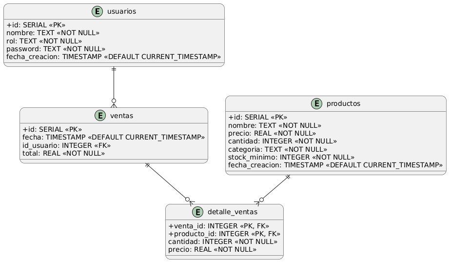
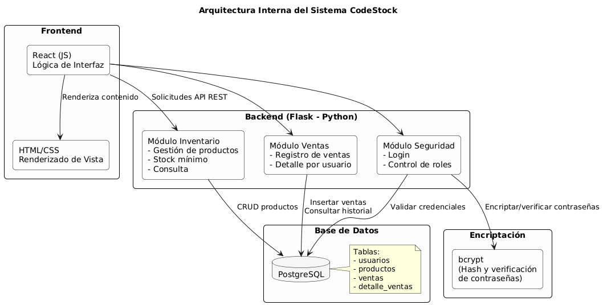

# CodeStock

---

## ✅ 1. Introducción

**Necesidad Identificada:**
Negocios como la papelería de Mónica Monsalve llevan su inventario de forma manual, lo que genera errores, falta de trazabilidad y dependencia total del administrador.

**Problemas:**
- Stock no registrado.
- Ventas sin historial.
- Errores por falta de etiquetas y control.
- Reposición verbal sin trazabilidad.

**Solución Propuesta:**
Una plataforma digital de inventario que permita registrar productos, registrar ventas, consultar historial y visualizar el estado actual de stock en tiempo real. Se enfoca en ser simple, seguro, y adaptado a las necesidades reales del negocio.

---

## 🔍 2. Soluciones similares en el mercado

**Ejemplos:**
- **Vendus**, **Contabilium**, **Tiendanube** (para negocios pequeños)

**Ventajas de esos sistemas:**
- Facturación electrónica.
- Reportes financieros.
- Multi-sucursal.

**Desventajas frente a CodeStock:**
- Costos mensuales.
- Exceso de funcionalidades innecesarias.
- Curva de aprendizaje más alta.

---

## 🧠 3. Descripción de la Solución Propia: CodeStock

### 🎯 Objetivos
- Agilizar y automatizar el manejo de inventario y ventas.
- Aumentar la trazabilidad.
- Permitir uso sin necesidad del administrador.
- Implementar control de roles (admin vs empleado).

### 👥 Metodología de trabajo
- **Equipo:** Alejandro, Anderson y Brahian.
- **Cliente:** Mónica Monsalve.
- **División de roles:**
  - Alejandro: Backend y base de datos.
  - Anderson: Frontend React + conexión con backend.
  - Brahian: DevOps (Jenkins + Docker + Minikube).

---

## 📌 4. Diagramas Técnicos

### 📌 Casos de Uso

### 📌 Diagrama de Clases

### 📌 Diagrama ER (Entidad-Relación)

### 📌 Diagrama de Arquitectura

### 📌 Diagrama de Despliegue en Minikube

### Explicación del Diagrama de Despliegue en Minikube

En este diagrama se muestra cómo desplegamos y conectamos todos los componentes de CodeStock dentro de Minikube:

- Desplegamos los pods de backend (Flask), frontend (React + Nginx), base de datos (PostgreSQL) y Jenkins en el clúster de Minikube.
- Cada pod está asociado a un servicio de Kubernetes, lo que permite la comunicación interna entre los componentes.
- El frontend se comunica con el backend a través del servicio interno, y el backend accede a la base de datos mediante su propio servicio.
- Jenkins y Kaniko trabajan juntos para construir y actualizar las imágenes de los servicios, que luego son descargadas y desplegadas automáticamente por Kubernetes.
- Usamos volúmenes persistentes para asegurar que los datos de la base de datos no se pierdan si el pod se reinicia.
- Finalmente, exponemos el frontend mediante un servicio tipo LoadBalancer, permitiendo que los usuarios accedan a la aplicación desde su navegador.

De esta manera, logramos un despliegue automatizado, seguro y escalable de toda la aplicación en Minikube.

---

### 📌 Flujo Dev → Minikube (CI/CD)

### Explicación del Diagrama del Flujo Dev → Minikube (CI/CD)

Este diagrama representa el ciclo completo de integración y despliegue continuo (CI/CD) de CodeStock, desde que realizamos un cambio en el código hasta que la aplicación está corriendo en Minikube.

**Paso a paso del flujo:**

- **Desarrolladores**
  - Realizamos cambios en el código fuente (frontend o backend) y los subimos (push) al repositorio de GitHub.

- **GitHub**
  - Al recibir el nuevo código, GitHub notifica automáticamente a Jenkins (por webhook o polling).

- **Jenkins (Pipeline CI/CD)**
  - Jenkins detecta el cambio y ejecuta el pipeline definido en el Jenkinsfile.
  - El pipeline realiza pruebas, construye las imágenes Docker y orquesta el proceso de CI/CD.

- **Kaniko**
  - Jenkins lanza un pod Kaniko dentro de Minikube.
  - Kaniko construye las imágenes Docker de frontend y backend de forma segura (sin requerir Docker daemon).

- **Docker Hub**
  - Kaniko sube las imágenes recién construidas a Docker Hub, el registro de imágenes en la nube.

- **Minikube (Kubernetes)**
  - Kubernetes detecta que hay nuevas imágenes en Docker Hub.
  - Descarga las imágenes y actualiza los pods correspondientes (backend, frontend, base de datos).

- **Aplicación Desplegada**
  - Los pods actualizados quedan corriendo en Minikube.
  - Los usuarios finales pueden acceder a la aplicación a través del frontend, que se comunica con el backend y la base de datos.

**¿Por qué es importante este flujo?**

- **Automatización total:** No necesitamos hacer despliegues manuales, todo ocurre automáticamente tras cada cambio en el código.
- **Reproducibilidad:** Siempre que hacemos un push, el entorno se reconstruye igual, evitando errores humanos.
- **Escalabilidad y buenas prácticas:** Usar CI/CD y Kubernetes es el estándar en la industria para proyectos modernos y escalables.

Este flujo nos permite enfocarnos en el desarrollo y la mejora continua, confiando en que cada cambio se integrará y desplegará de forma segura y automática en nuestro entorno de Minikube.

---

## 🛠️ Herramientas Usadas

- **Backend:** Flask (Python)
- **Frontend:** React
- **Base de datos:** PostgreSQL
- **CI/CD:** GitHub, Jenkins, Kaniko, Docker Hub
- **Orquestación:** Kubernetes (Minikube)
- **Seguridad:** bcrypt
- **Versionado:** Git

---

## 🧾 7. Conclusiones

### ✔ Generales de la App:
- La solución cumple con lo prometido: inventario funcional, seguro y usable.
- Evita los errores frecuentes del manejo manual.
- Se adapta a negocios pequeños que no necesitan facturación electrónica.

### ✔ Generales del Curso:
- Se aplicaron conocimientos de arquitectura limpia, despliegue en contenedores, automatización de pipelines, y prácticas de seguridad.
- Trabajo colaborativo con control de versiones y división efectiva de tareas.

### ✔ Herramientas:
- Jenkins + Kaniko + Minikube como un stack completo de CI/CD.
- PostgreSQL bien adaptado al dominio del problema.
- React y Flask permiten una app moderna y ligera.
